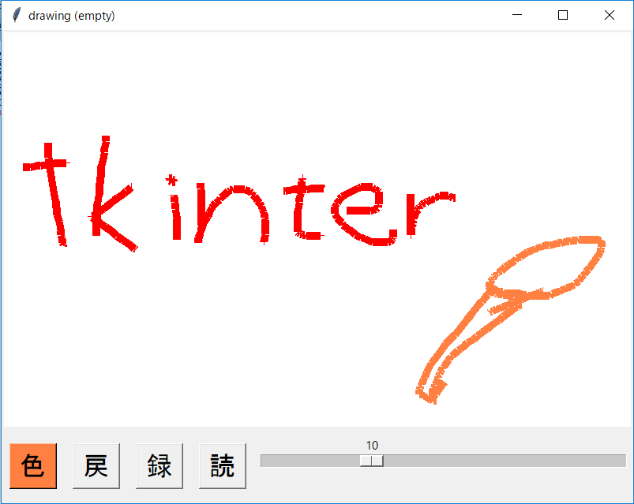

drawing board example program
=============================

PythonのGUIフレームワーク[Tkinter](https://docs.python.jp/3/library/tkinter.html)を用いた絵描きボードプログラム。
GUIフレームワークのHelloWorldとして、[Kivy](https://kivy.org/#home)との比較の為に作ってみた。

操作はとてもシンプル、線を描く、描写をやり直す、絵を保存、絵を読み込むのみ。
習うより慣れろ、忙しい中にもコーディングを！の精神で作った。

必要なモノ
---------
* Python3

使い方
-----
`python drawing.py`

Windowsバイナリ作成方法
----------------------
`build-pyinstaller.sh` を実行するのみ。CommandNotFoundな時は `sh` を `bat` に変えればよいかも。
うまくいくと `dist` にEXEができているはず。

Memo
----
Tkinterはシンプルで簡単で初心者フレンドりーな印象。
Pythonに標準で入っているし、日本語など打ち込んでも文字化けしないので困らない。
初心者の為のGUIフレームワークと言えそう。簡単な操作のみのGUI画面が必要ならばコレでいいと思う。

ただし、簡単でないGUIならば苦労するしできない事が多い。また、いろいろ設計が古いところがあり、今風の操作画面を作ることができなし、
Tkinter自体はシングルスレッドだと制限がかけられているようだ、条件はよくわからないがマルチスレッディングなプログラムを書くと例外を出される。

KivyにはKivyファイルという形で外部にスタイルシートを格納する事ができ、Pyファイルには純粋に動作のみ記述できるので
プログラムの規模が大きくなるとKivyの方が後々楽になる。だけど別に記述するせいか学習コストが高くなっているので、Python初心者が急に
やろうとすると困惑するかもしれない。もちろんKivyファイルを使わないやり方もあるけど日本語情報が少ないのが難点。

License
-------
MIT
